---
output:
  html_document:
    fig_caption: yes
    keep_md: yes
    toc: yes
  pdf_document:
    toc: yes
---

Plot 1
======

*Have total emissions from PM2.5 decreased in the United States from 1999 to
2008?*

The following plot shows the total PM2.5 emission from all sources for each of
the years 1999, 2002, 2005, and 2008.

The plot below shows that the total emissions from PM2.5 have decreased in the
United States from 1999 to 2008.

### (1a)
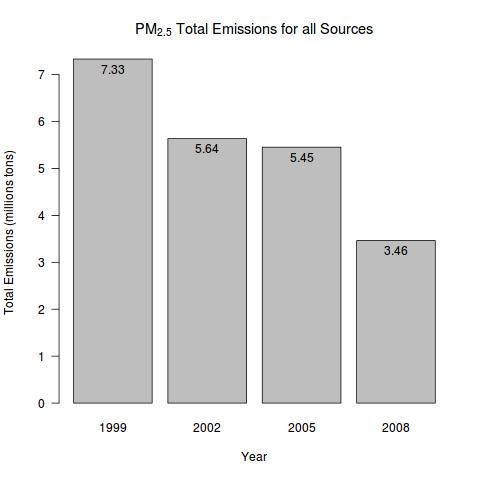

[source (plot1a.R)](plot1a.R)

### (1b)
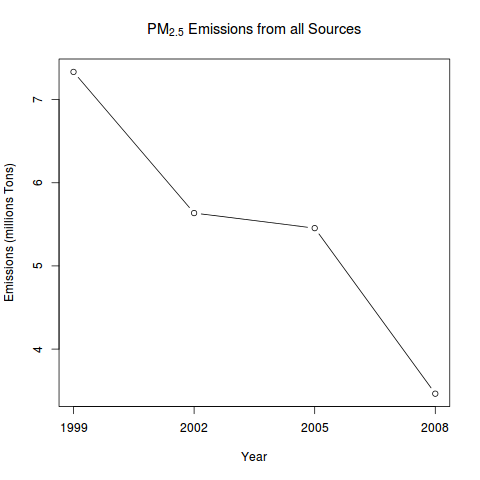

[source (plot1b.R)](plot1b.R)

Plot 2
======

*Have total emissions from PM2.5 decreased in the Baltimore City,
Maryland from 1999 to 2008?*

A linear regression model suggests that the total emissions in Baltimore City
have been decreasing from 1999 to 2008.

* Baltimore City, Maryland (`fips` == "24510")

### (2a)
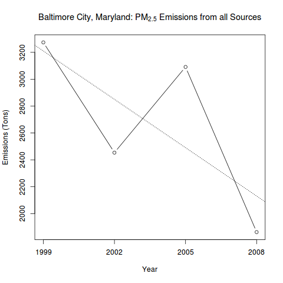

[source (plot2a.R)](plot2a.R)

Plot 3
======

*Of the four types of sources indicated by the type (point, nonpoint, onroad,
nonroad) variable, which of these four sources have seen decreases in emissions
from 1999–2008 for Baltimore City? Which have seen increases in emissions from
1999–2008?*

A linear regression model indicates that only the `point` source has
increased emissions over the years 1999 to 2008.

### (3a)
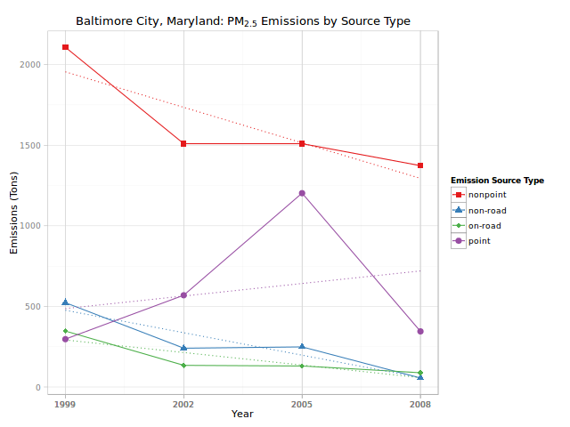

[source (plot3a.R)](plot3a.R)

Plot 4
======

*Across the United States, how have emissions from coal combustion-related
sources changed from 1999–2008?*

Point emissions from coal combustion-related sources have decreased. Non-point
emissions from coal combustion-related sources have remained static.

### (4a)
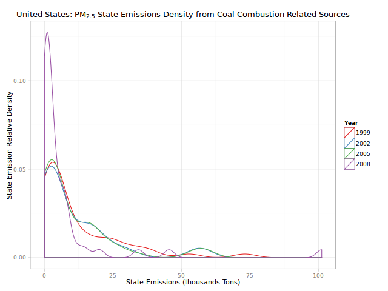

[source (plot4a.R)](plot4a.R)

### (4b)
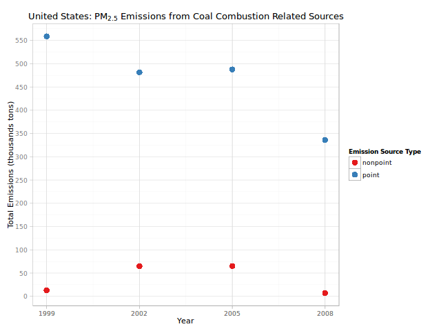

[source (plot4b.R)](plot4b.R)

### (4c)
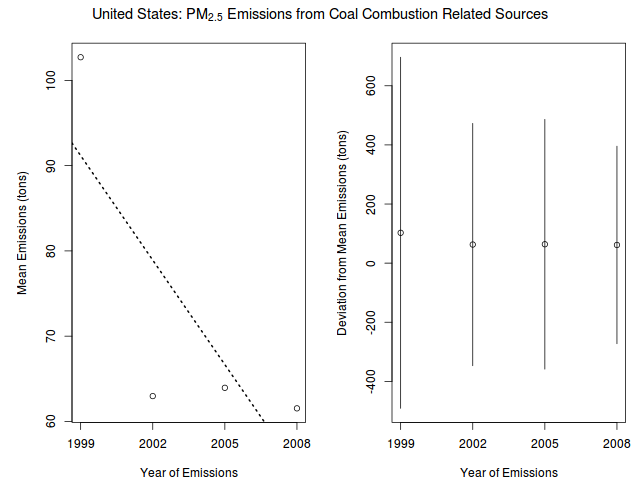

[source (plot4c.R)](plot4c.R)

### (4d)
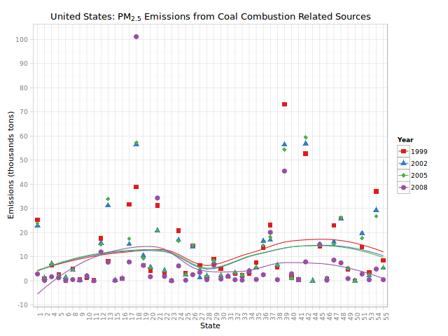

[source (plot4d.R)](plot4d.R)

### (4e)
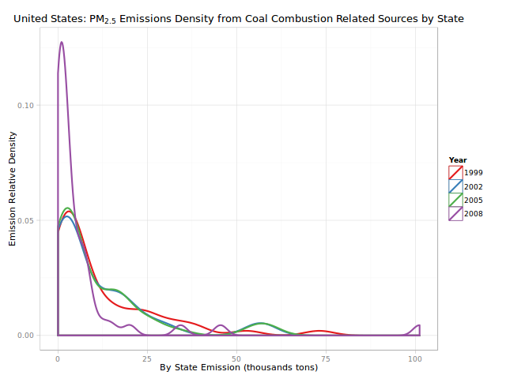

[source (plot4e.R)](plot4e.R)

Plot 5
======

*How have emissions from motor vehicle sources changed from 1999–2008 in
Baltimore City?*

There has been an overall reduction in motor vehicle emissions.

### (5a)
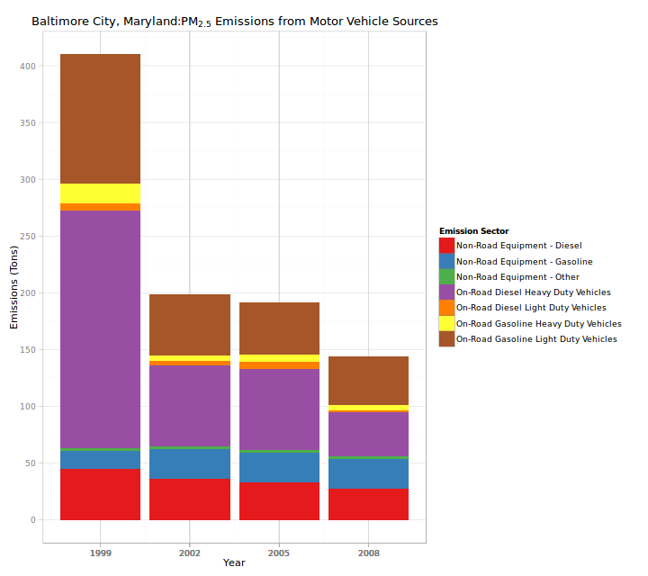

[source (plot5a.R)](plot5a.R)

### (5b)
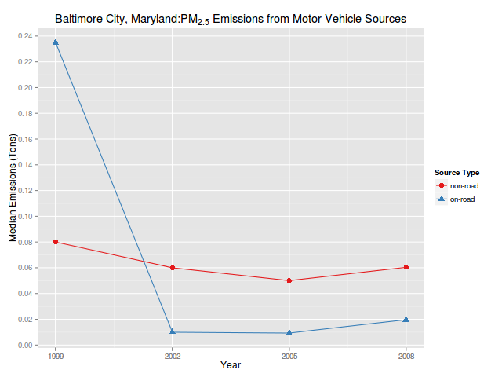

[source (plot5b.R)](plot5b.R)

Plot 6
======

*Compare emissions from motor vehicle sources in Baltimore City with emissions
from motor vehicle sources in Los Angeles County, California. Which city has
seen greater changes over time in motor vehicle emissions?*

* Baltimore City, Maryland (`fips` == "24510")
* Los Angeles County, California (`fips` == "06037")

Los Angeles County has seen seen the greatest fluctuation in emissions.

### (6a)
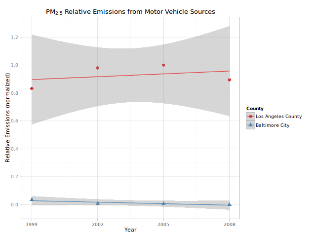

[source (plot6a.R)](plot6a.R)

### (6b)
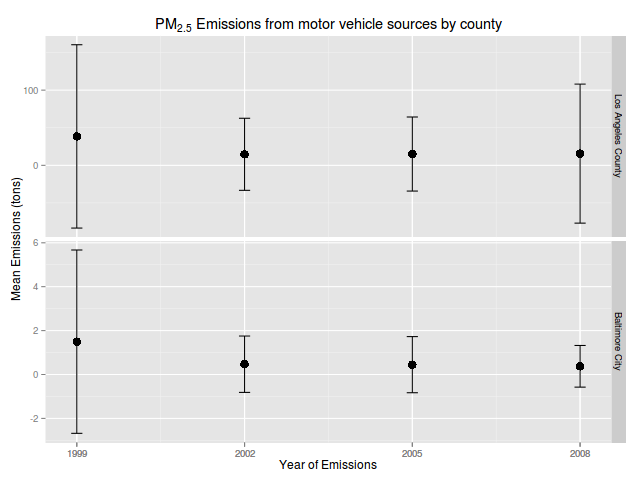

[source (plot6b.R)](plot6b.R)

### (6c)
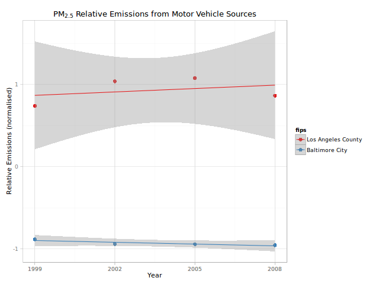

[source (plot6c.R)](plot6c.R)

Resources
=========

* [An easy way to start using R in your research exploratory data analysis](http://bitesizebio.com/19666/an-easy-way-to-start-using-r-in-your-research-exploratory-data-analysis/)
* [EPA Emission Basics](http://www.epa.gov/air/emissions/basic.htm)
* [EPA FIPS State Codes](http://www.epa.gov/envirofw/html/codes/state.html)
* [EPA Inventory Data](http://www.epa.gov/ttn/chief/net/2002inventory.html#inventorydata)
* [EPA National Emissions Inventory web site](http://www.epa.gov/ttn/chief/eiinformation.html)
* [ggplot2 bar and line graphs](http://www.cookbook-r.com/Graphs/Bar_and_line_graphs_(ggplot2)/)
* [ggplot2 shapes](http://sape.inf.usi.ch/quick-reference/ggplot2/shape)
* [Plot hints](https://www.stat.auckland.ac.nz/~paul/RGraphics/chapter3.html)
* [Project Data Set](https://d396qusza40orc.cloudfront.net/exdata%2Fdata%2FNEI_data.zip) [29Mb]
